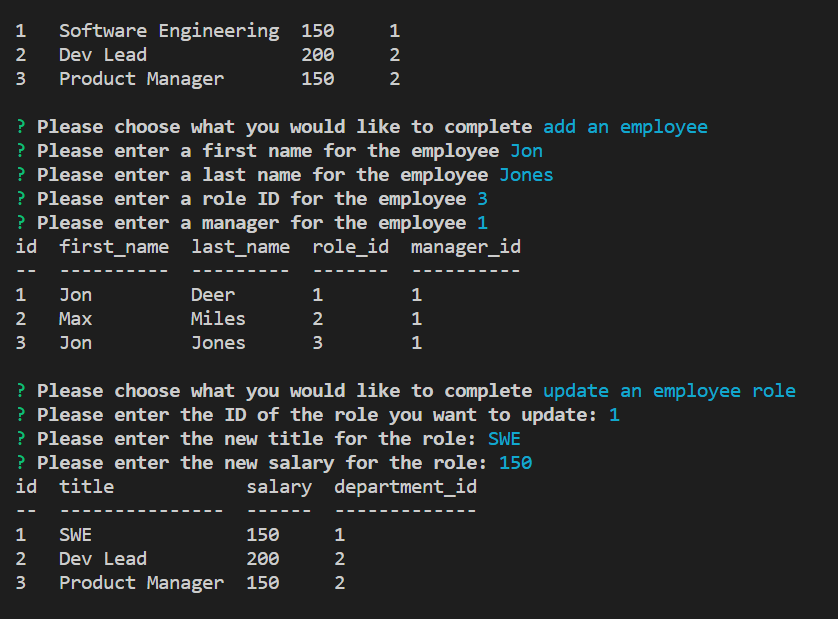

# <Employee-Management-System-SQL>

## Description

This application is a content management system that utilizes SQL and Node.js in order to enable a user to create, read and write to a database of their employees. This application was built for the purpose of using Node.js and SQL within real-world tools. By doing this, I was able to learn how to write code that stores to a database. 

## Table of Contents (Optional)

If your README is long, add a table of contents to make it easy for users to find what they need.

- [Installation](#installation)
- [Usage](#usage)
- [Credits](#credits)
- [License](#license)

## Installation

To install this application, start by installing Node.js. From here, leverage the node package library by running "npm install i" in your command line. Additionally, please install the inquirer package by using the command "npm i inquirer@8.2.4". You will also need to install the mysql2 package. You can install this using the command line "npm install --save mysql2". Lastly, install the console table package using the following command line interval "npm install install console.table --save". 

## Usage

To use this application, please run your command line terminal. From here, use the command "node index.js" to run the code. From here, you will be prompted with questions to view and update the databases.

Please see a photo below of the example results: 

Link to demonstration video:
https://youtu.be/1lVpRdYCvo4 

## Credits

No collaborators were involved in this. This code does leverage Node.js inquirer packages, mysql2 and the npm console table outline below:
MySQL2:
https://www.npmjs.com/package/mysql2
Console.Table:
https://www.npmjs.com/package/console.table 

## License

This uses the MIT license. Please feel free to reference the code as you so choose. 

## How to Contribute

No contribution is needed at this time. Please feel free to reach out with recommendations on how the application could be improved.

## Tests
Please feel free to test the application by running 'node index.js' and trying the various options within the portal. 
